# Sepsis Prediction System - Architecture Diagram

```mermaid
graph TB
    %% Frontend Layer
    subgraph "Frontend (React + Vite)"
        UI[User Interface]
        NAV[Navigation Component]
        DASH[Dashboard Page]
        PRED[Prediction Page]
        WARN[Sepsis Warning Page]
        MODEL[Model Architecture Page]
        
        UI --> NAV
        NAV --> DASH
        NAV --> PRED
        NAV --> WARN
        NAV --> MODEL
    end

    %% Backend API Layer
    subgraph "Backend API (FastAPI)"
        API[FastAPI Server]
        CORS[CORS Middleware]
        
        %% API Endpoints
        HEALTH[GET / - Health Check]
        TEST[GET /test - Test Endpoint]
        SEV_POST[POST /severity - Severity Prediction]
        SEV_GET[GET /severity - Method Not Allowed]
        WARN_POST[POST /sepsis-warning - Early Warning]
        WARN_GET[GET /sepsis-warning - Method Not Allowed]
        PRED_POST[POST /predict - Early Warning Alias]
        PRED_GET[GET /predict - Method Not Allowed]
        PRED_SEV_POST[POST /predict-severity - Severity Alias]
        PRED_SEV_GET[GET /predict-severity - Method Not Allowed]
        
        API --> CORS
        CORS --> HEALTH
        CORS --> TEST
        CORS --> SEV_POST
        CORS --> SEV_GET
        CORS --> WARN_POST
        CORS --> WARN_GET
        CORS --> PRED_POST
        CORS --> PRED_GET
        CORS --> PRED_SEV_POST
        CORS --> PRED_SEV_GET
    end

    %% ML Models Layer
    subgraph "Machine Learning Models"
        %% Severity Prediction Models
        SEV_MODEL[Severity Model<br/>sepsis_honest_73_balanced.pkl<br/>OR sepsis_balanced_70_70.pkl]
        SEV_SCALER[Severity Scaler<br/>sepsis_scaler.pkl]
        HEALTHY_MED[Healthy Medians<br/>healthy_medians.pkl]
        CLINICAL_BRIDGE[Clinical Bridge<br/>clinical_bridge.pkl]
        FEATURE_NAMES[Feature Names<br/>feature_names.pkl]
        
        %% Early Warning Models
        DECISION_ENGINE[Sepsis Decision Engine<br/>sepsis_decision_engine.pkl]
        BASE_VITALS[Base Vitals Model<br/>base_vitals_model.pkl]
        
        %% Additional Models
        PROD_MODEL[Production Model<br/>sepsis_production_model.pkl]
        SEVERITY_FINAL[Severity Final Model<br/>sepsis_severity_model_FINAL_3CLASS.pkl]
        WORD_MAP[Word Mapping<br/>word_map.pkl]
    end

    %% Data Processing Layer
    subgraph "Data Processing & Validation"
        %% Data Schemas
        PATIENT_DATA[PatientData Schema<br/>Basic vitals + labs]
        SEVERITY_DATA[SeverityData Schema<br/>Comprehensive clinical data]
        SEPSIS_WARNING_DATA[SepsisEarlyWarningData Schema<br/>Vitals + lactate + creatinine]
        
        %% Processing Components
        UI_MAP[UI to Model Mapping<br/>Field name translation]
        CLINICAL_GUARDRAILS[Clinical Guardrails<br/>Critical value overrides]
        Z_SCORE[Z-Score Normalization<br/>Clinical Bridge scaling]
        FEATURE_ENG[Feature Engineering<br/>Shock index, MAP calculation]
    end

    %% Connections between layers
    
    %% Frontend to Backend
    DASH -.->|HTTP Request| API
    PRED -.->|POST /predict| API
    WARN -.->|POST /sepsis-warning| API
    MODEL -.->|GET /| API
    
    %% Backend to Data Processing
    SEV_POST --> SEVERITY_DATA
    WARN_POST --> SEPSIS_WARNING_DATA
    PRED_POST --> SEPSIS_WARNING_DATA
    PRED_SEV_POST --> SEVERITY_DATA
    
    %% Data Processing to Models
    SEVERITY_DATA --> UI_MAP
    UI_MAP --> Z_SCORE
    Z_SCORE --> SEV_MODEL
    SEV_MODEL --> SEV_SCALER
    CLINICAL_GUARDRAILS --> SEV_MODEL
    
    SEPSIS_WARNING_DATA --> FEATURE_ENG
    FEATURE_ENG --> BASE_VITALS
    BASE_VITALS --> DECISION_ENGINE
    
    %% Model Dependencies
    SEV_MODEL --> FEATURE_NAMES
    SEV_MODEL --> HEALTHY_MED
    Z_SCORE --> CLINICAL_BRIDGE
    DECISION_ENGINE --> WORD_MAP
    
    %% Response Flow
    SEV_MODEL -->|Prediction Results| API
    DECISION_ENGINE -->|Risk Score| API
    API -->|JSON Response| UI

    %% Styling
    classDef frontend fill:#e1f5fe,stroke:#01579b,stroke-width:2px
    classDef backend fill:#f3e5f5,stroke:#4a148c,stroke-width:2px
    classDef models fill:#e8f5e8,stroke:#1b5e20,stroke-width:2px
    classDef processing fill:#fff3e0,stroke:#e65100,stroke-width:2px
    
    class UI,NAV,DASH,PRED,WARN,MODEL frontend
    class API,CORS,HEALTH,TEST,SEV_POST,SEV_GET,WARN_POST,WARN_GET,PRED_POST,PRED_GET,PRED_SEV_POST,PRED_SEV_GET backend
    class SEV_MODEL,SEV_SCALER,HEALTHY_MED,CLINICAL_BRIDGE,FEATURE_NAMES,DECISION_ENGINE,BASE_VITALS,PROD_MODEL,SEVERITY_FINAL,WORD_MAP models
    class PATIENT_DATA,SEVERITY_DATA,SEPSIS_WARNING_DATA,UI_MAP,CLINICAL_GUARDRAILS,Z_SCORE,FEATURE_ENG processing
```

## Architecture Overview

### **Frontend Layer (React + Vite)**
- **Technology Stack**: React 19.2.0, Vite 7.2.4, TailwindCSS 4.1.18
- **Components**:
  - Navigation system with routing
  - Dashboard for overview
  - Prediction interface for severity classification
  - Sepsis Warning interface for early detection
  - Model Architecture documentation page

### **Backend API Layer (FastAPI)**
- **Technology Stack**: FastAPI, Uvicorn, Python
- **Key Features**:
  - CORS middleware for cross-origin requests
  - Multiple endpoints for different prediction types
  - Comprehensive error handling and validation
  - Health check and test endpoints

### **Machine Learning Models Layer**
- **Severity Prediction Pipeline**:
  - Primary model: `sepsis_honest_73_balanced.pkl` (or alternatives)
  - Scaler: `sepsis_scaler.pkl` for feature normalization
  - Clinical Bridge: `clinical_bridge.pkl` for Z-score scaling
  - Healthy medians: `healthy_medians.pkl` for baseline values

- **Early Warning System**:
  - Base Vitals Model: `base_vitals_model.pkl` for vitals probability
  - Decision Engine: `sepsis_decision_engine.pkl` for final risk scoring
  - Word mapping for feature translation

### **Data Processing & Validation Layer**
- **Data Schemas**: Pydantic models for input validation
- **Feature Engineering**: Shock index, MAP calculation, lactate trends
- **Clinical Guardrails**: Override logic for critical values
- **UI Mapping**: Translation between UI field names and model features

## Data Flow

1. **User Input** → Frontend forms collect patient data
2. **HTTP Request** → Frontend sends POST requests to FastAPI endpoints
3. **Validation** → Pydantic schemas validate input data
4. **Feature Processing** → UI mapping, Z-score normalization, feature engineering
5. **Model Inference** → Appropriate ML models make predictions
6. **Clinical Guardrails** → Critical value overrides applied if needed
7. **Response** → Results formatted and returned to frontend
8. **Display** → Frontend renders predictions with confidence scores

## Key Technical Features

- **Hierarchical Stacking Ensembles** for early warning
- **Clinical Calibration** via Z-score normalization
- **Metabolic Velocity Analysis** through temporal features
- **Zero-Miss Safety Profiles** with clinical guardrails
- **Real-time Inference** with sub-100ms latency
- **Multi-class Severity Classification** (Healthy, Mild, Severe/Critical)
