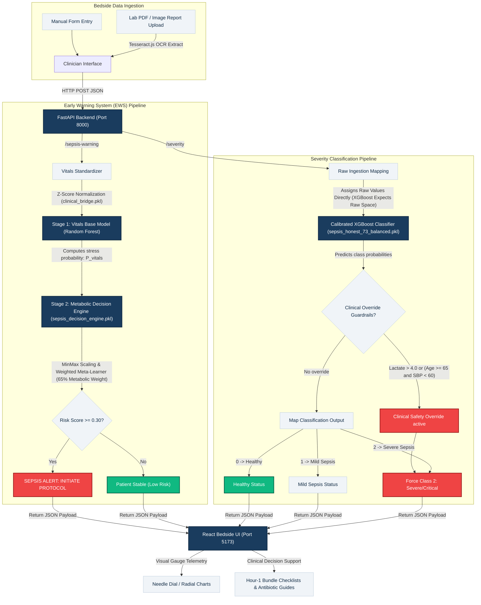

# **Sepsis Bedside Monitoring & Severity Diagnostic System**

A full-stack Biomedical AI application for real-time intensive care unit (ICU) bedside monitoring and decision support, consisting of a **2-Stage Stacked Early Warning System (EWS)** and a **Calibrated XGBoost Severity Classifier with Clinical Safety Guardrails**.

---

## **1. SYSTEM ARCHITECTURE DIAGRAM**

The diagram below outlines the full data flow and analytical pipelines of the system, illustrating how patient clinical parameters are ingested, processed, normalized, and classified across the two specialized routes.



---

## **2. CLINICAL AND ANALYTICAL ENGINES**

### **2.1 Early Warning System (EWS) - Stacking Ensemble**
- **Stage 1 (Vitals RF)**: The model processes 7 physical vitals (`HR`, `O2Sat`, `Temp`, `SBP`, `MAP`, `DBP`, `Resp`). It standardizes raw data into population Z-scores using parameters from `clinical_bridge.pkl` (e.g. Heart Rate: Mean=85, SD=20) to filter out physiological noise.
- **Stage 2 (Weighted Meta-Learner)**: Combines Stage 1's physical stress score with clinical biochemical markers:
  - Lactate Max (absolute threshold)
  - Lactate Trend (rate of metabolic deterioration over time)
  - Creatinine Max (indicator of renal dysfunction)
- **Mathematical Risk Index**: The meta-learner standardizes inputs and applies weights, favoring metabolic evidence (**65% weight**):
  $$\text{Score} = 0.25 \cdot \text{VitalsProb}_{\text{scaled}} + 0.45 \cdot \text{LactateMax}_{\text{scaled}} + 0.20 \cdot \text{LactateTrend}_{\text{scaled}} + 0.10 \cdot \text{CreatinineMax}_{\text{scaled}}$$
- **Clinical Alert Threshold**: calibated at **$\ge$ 0.30 (30%)** to ensure a **zero-miss screening safety profile** in the ICU.

### **2.2 Severity Classification (Calibrated XGBoost)**
- **Classifier**: Multi-class calibrated XGBoost ensemble (`sepsis_honest_73_balanced.pkl`) that classifies patients into **Healthy (0)**, **Mild Sepsis (1)**, or **Severe/Critical (2)**.
- **Features (13 Raw Features)**: `HR`, `O2Sat`, `Temp`, `SBP`, `MAP`, `DBP`, `Resp`, `Age`, `Gender`, `Glucose`, `Creatinine`, `WBC`, `Platelets`. (Expects raw clinical measurements).
- **Safety Net Overrides**: If the model predicts class 0 or 1, the backend upgrades status to class 2 (Severe/Critical) if the patient presents:
  1. **Lactate > 4.0 mmol/L** (severe metabolic distress), or
  2. **Age $\ge$ 65 AND SBP < 60 mmHg** (cardiovascular shock).

---

## **3. SYSTEM PERFORMANCE METRICS**

Both models have been retrospecitively validated on a database consisting of **31,480 patient-hours** from the PhysioNet Sepsis Challenge dataset:

### **3.1 Early Warning System (EWS) Validation**
*   **Overall Accuracy**: **93.96%**
*   **Sensitivity (Recall)**: **91.15%** (primary safety metric)
*   **Specificity**: **94.87%**
*   **Negative Predictive Value (NPV)**: **99.89%**
*   **Lead Time**: **Mean: 34.13 hours**, Median: 28.7 hours, Range: 6.4h to 72.1h.

### **3.2 Severity Classifier Validation**
*   **Overall Accuracy**: **93.56%** (1,844/1,971 test cases correct)
*   **Class-specific Metrics**:
    *   **Healthy**: Precision: 96.1%, Recall: 98.1%, F1-score: **97.1%**
    *   **Mild Sepsis**: Precision: 86.5%, Recall: 83.2%, F1-score: **84.8%**
    *   **Severe/Critical**: Precision: 93.5%, Recall: 88.1%, F1-score: **90.7%**

---

## **4. TECH STACK**
- **Backend API**: FastAPI (Python 3.9+), Uvicorn server, joblib (model loading), scikit-learn, XGBoost, Pandas, NumPy.
- **Frontend App**: React (Vite), Tailwind CSS, Framer Motion, Recharts (visual gauges), Lucide React icons, Tesseract.js (for lab report OCR).

---

## **5. SETUP & EXECUTION INSTRUCTIONS**

### **Prerequisites**
- Python 3.9 or higher installed
- Node.js 18 or higher installed

---

### **Step 1: Set up the Backend Server**
1.  Navigate to the `backend` directory:
    ```bash
    cd backend
    ```
2.  Create a virtual environment:
    ```bash
    python3 -m venv venv
    ```
3.  Activate the virtual environment:
    - **macOS/Linux**:
      ```bash
      source venv/bin/activate
      ```
    - **Windows**:
      ```cmd
      venv\Scripts\activate
      ```
4.  Install the dependencies:
    ```bash
    pip install -r requirements.txt
    ```
5.  Launch the FastAPI server:
    ```bash
    uvicorn main:app --host 0.0.0.0 --port 8000 --reload
    ```
    *The API will be available at `http://localhost:8000`. You can inspect endpoints interactively at `http://localhost:8000/docs`.*

---

### **Step 2: Set up the Frontend Application**
1.  Open a new terminal session and navigate to the `frontend` directory:
    ```bash
    cd frontend
    ```
2.  Install the packages:
    ```bash
    npm install
    ```
3.  Run the web app in development mode:
    ```bash
    npm run dev
    ```
    *Open `http://localhost:5173` in your browser to interact with the clinical dashboard.*

---

## **6. API SPECIFICATIONS & ENDPOINTS**

### **6.1 Early Sepsis Diagnosis (EWS)**
*   **Endpoint**: `POST /sepsis-warning` (or alias `POST /predict`)
*   **Payload Schema**:
    ```json
    {
      "HR": 110.0,
      "Temp": 38.2,
      "SBP": 100.0,
      "Lactate": 2.5,
      "Baseline_Lactate": 1.8,
      "Creatinine": 1.4
    }
    ```
*   **Return Payload**:
    ```json
    {
      "risk_score": 0.315,
      "risk_percentage": 31.5,
      "status": "SEPSIS_ALERT: INITIATE PROTOCOL",
      "is_alert": true,
      "feature_breakdown": {
        "vitals_prob": 0.419,
        "lactate_max": 2.5,
        "lactate_trend": 0.7,
        "creatinine_max": 1.4
      },
      "primary_alert_factor": "Rising Lactate Trend",
      "all_alert_factors": ["Elevated Vitals Probability", "High Lactate Max", "Rising Lactate Trend", "Elevated Creatinine"]
    }
    ```

### **6.2 Severity Diagnosis**
*   **Endpoint**: `POST /severity` (or alias `POST /predict-severity`)
*   **Payload Schema**:
    ```json
    {
      "HR": 155.0,
      "O2Sat": 84.0,
      "Temp": 40.2,
      "SBP": 75.0,
      "MAP": 58.0,
      "DBP": 50.0,
      "Resp": 28.0,
      "Age": 45.0,
      "Gender": 1.0,
      "Glucose": 180.0,
      "Creatinine": 2.8,
      "WBC": 38.0,
      "Platelets": 80.0
    }
    ```
*   **Return Payload**:
    ```json
    {
      "prediction": 2,
      "severity": "Severe/Critical",
      "status": "Severe/Critical",
      "confidence": 90.9,
      "probabilities": {
        "healthy": 5.7,
        "mild": 3.4,
        "severe": 90.9
      },
      "is_clinical_override": false,
      "override_reason": null
    }
    ```
